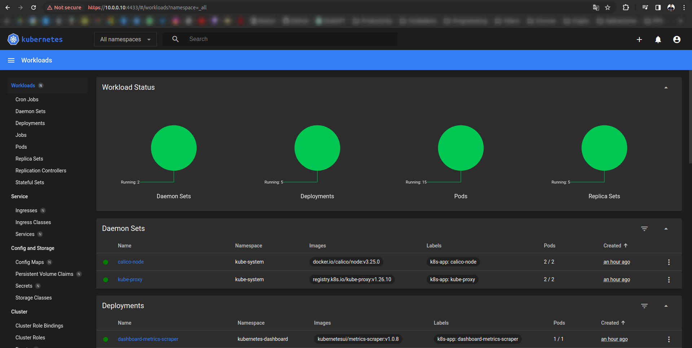

# Cómo levantar un Clúster de Kubernetes con Vagrant

## Personalizar nuestros archivos de configuración

Ingresamos al archivo `settings.yml` y elegimos la cantidad de nodos que deseemos, también la versión de Kubernetes. Además seleccionamos los recursos.

En nuestro caso se dejó de la siguiente manera:

```yaml
---
# cluster_name is used to group the nodes in a folder within VirtualBox:
cluster_name: Kubernetes Cluster
network:
  # Worker IPs are simply incremented from the control IP.
  control_ip: 10.0.0.10
  dns_servers:
    - 8.8.8.8
    - 1.1.1.1
  pod_cidr: 172.16.1.0/16
  service_cidr: 172.17.1.0/18
nodes:
  control:
    cpu: 2
    memory: 4096
  workers:
    count: 1
    cpu: 2
    memory: 4096

software:
  box: bento/ubuntu-22.04
  calico: 3.25.0
  kubernetes: 1.26.1-00
  os: xUbuntu_22.04


```

## Levantar máquinas virtuales de Vagrant

Levantarlas:

```sh
vagrant up
```

Si deseamos eliminarlas:

```sh
vagrant destroy
```

## Levantar un servicio de prueba

Habiendo ingresado por SSH al master node crearemos un archivo `deploy-nginx.yml` que contenga lo siguiente:

```yaml
---
apiVersion: apps/v1
kind: Deployment
metadata:
  name: nginx-deployment
spec:
  selector:
    matchLabels:
      app: nginx
  replicas: 2 
  template:
    metadata:
      labels:
        app: nginx
    spec:
      containers:
      - name: nginx
        image: nginx:latest
        resources:
          limits:
            cpu: "0.5"
            memory: "256Mi"
          requests:
            cpu: "0.25"
            memory: "128Mi"
        ports:
        - containerPort: 80
---
apiVersion: v1
kind: Service
metadata:
  name: nginx-service
spec:
  selector:
    app: nginx
  type: NodePort
  ports:
    - port: 80
      targetPort: 80
      nodePort: 32000
```

Hacemos el deploy:

```sh
kubectl apply -f deploy-nginx.yml 
```

Y como ya está configurado el Port Forwarding al puerto 32000 y la IP privada de nuestra VPC dentro de las vboxnet es la `10.0.0.10`, accedemos:

```link
http://10.0.0.10:32000/
```

Lo que nos devolverá, si hicimos todo con éxito, lo siguiente:


## Levantar servicio del Dashboard

### Deploy de la UI del Dashboard

En el master node:

```sh
kubectl apply -f https://raw.githubusercontent.com/kubernetes/dashboard/v2.7.0/aio/deploy/recommended.yaml
```

### Creación de los tokens

Necesitamos hacer deploy de diferentes configuraciones, para ello creamos los siguientes archivos:

- Creación de la Cuenta de Servicio

  `dashboard_service_account.yml`
  
  ```yaml
  apiVersion: v1
  kind: ServiceAccount
  metadata:
    name: admin-user
    namespace: kubernetes-dashboard
  ```

  Aplicamos configuración:

  ```sh
  kubectl apply -f dashboard_service_account.yml
  ```

- Creación de ClusterRoleBinding

  `dashboard_cluster_role_binding.yml`

  ```yaml
  apiVersion: rbac.authorization.k8s.io/v1
  kind: ClusterRoleBinding
  metadata:
    name: admin-user
  roleRef:
    apiGroup: rbac.authorization.k8s.io
    kind: ClusterRole
    name: cluster-admin
  subjects:
  - kind: ServiceAccount
    name: admin-user
    namespace: kubernetes-dashboard
  ```

  Aplicamos configuración:

  ```sh
  kubectl apply -f dashboard_cluster_role_binding.yml
  ```

- Crear el Bearer Token para la cuenta de servicio:

  ```sh
  kubectl -n kubernetes-dashboard create token admin-user
  ```

  **Importante!** Copiar.

- Crear un "long-lived" bearer token para la Service Account:

  `dashboard_long_lived_token.yml`

  ```yaml
  apiVersion: v1
  kind: Secret
  metadata:
    name: admin-user
    namespace: kubernetes-dashboard
    annotations:
      kubernetes.io/service-account.name: "admin-user"   
  type: kubernetes.io/service-account-token 
  ```

  Aplicamos los cambios:

  ```sh
  kubectl apply -f dashboard_long_lived_token.yml
  ```

- Obtenemos el long-lived token:

  ```sh
  kubectl get secret admin-user -n kubernetes-dashboard -o jsonpath={".data.token"} | base64 -d
  ```

**Importante!** Debemos guardar los tokens o tenerlos en consola para luego poderlos usar para ingresar.

### Port forwarding

En el master node:
Buscamos la IP correspondiente al la red interna:

```sh
ip -c -brief a
```

En este caso, buscamos la IP correpondiente a la red que se ha creado como "red privada" en Vagrant, es decir, a la que ejecutando el mismo comando en la PC HOST corresponde a virtualbox, en nuestro caso `vboxnet3`:

```sh
lo               UNKNOWN        127.0.0.1/8 ::1/128 
eno1             DOWN           
wlo1             UP             192.168.102.13/24        
vboxnet3         UP             10.0.0.1/24 fe80::800:27ff:fe00:3/64 
```

Buscamos el puerto interno en el cual se encuentra el servicio del dashboard:

```sh
kubectl -n kubernetes-dashboard get svc
```

Lo que nos devuelve lo siguiente:

```sh
vagrant@master-node:~$ kubectl -n kubernetes-dashboard get svc
NAME                        TYPE        CLUSTER-IP      EXTERNAL-IP   PORT(S)    AGE
dashboard-metrics-scraper   ClusterIP   172.17.55.78    <none>        8000/TCP   69m
kubernetes-dashboard        ClusterIP   172.17.46.213   <none>        443/TCP    69m
```

Por lo cual seleccionamos el `puerto 443`.

Hacemos finalmente el forwarding del puerto:

```sh
kubectl -n kubernetes-dashboard port-forward --address 10.0.0.10 svc/kubernetes-dashboard 4433:443
```

## Acceso desde la PC Host

Accedemos por el navegador de la PC Host a la IP y puerto que configuramos, teniendo en cuenta de que sea HTTPS el protocolo:

```link
https://10.0.0.10:4433
```

Debería figurarnos el siguiente panel de ingreso, donde dejaremos seleccionada la opción "token" y pegaremos el token correspondiente a la cuenta de administrador que hemos creado primero.


Finalmente al ingresar veremos lo siguiente:



## Cosas por hacer

- [ ] Pasar todos los scripts y configuraciones a Ansible.

  - Incluir configuración de Dashboard

- [ ] Mejorar archivos de configuración según cada perfil requerido.

- [ ] Probar Kubeflow en su versión 1.7 (latest) usando los manifests y Kustomize.

  - [Repositorio de los manifest](https://github.com/kubeflow/manifests#installation)
  
  - [Local Storage Class](https://kubernetes.io/docs/concepts/storage/storage-classes/#local)

- [ ] Ver como hacer "accesible DESDE AFUERA" a las IP de los servicios que necesitemos.

## Referencias

[Medium post - Vagrant k8s](https://blog.devops.dev/how-to-setup-kubernetes-cluster-with-vagrant-e2c808795840)

[Github Repo riyasharma09/vagrant-kubernetes-cluster](https://github.com/riyasharma09/vagrant-kubernetes-cluster/tree/main)

[GPG Key error](https://github.com/kubernetes/website/issues/41246)

[Kubernetes Documentation - Dashboard](https://kubernetes.io/docs/tasks/access-application-cluster/web-ui-dashboard/)

[Kubernetes Documentation - Token generation](https://github.com/kubernetes/dashboard/blob/master/docs/user/access-control/creating-sample-user.md#getting-a-bearer-token-for-serviceaccount)

[Youtube - Kubernetes Dashboard - ¿Tiene algún uso real?](https://www.youtube.com/watch?v=B5r-_HHX31s)
